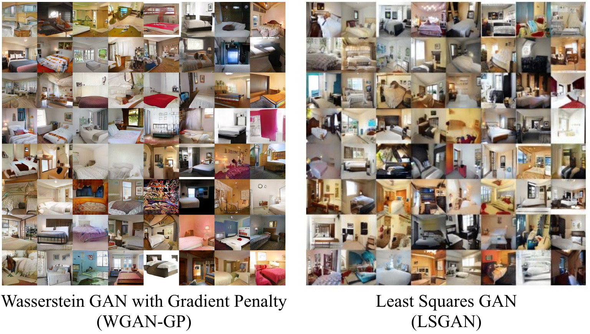
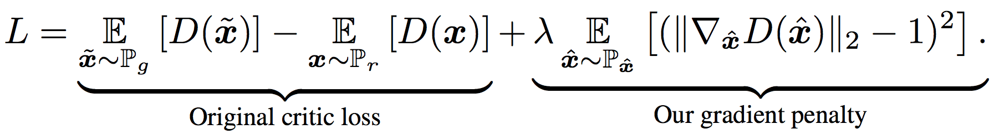

# Wasserstein GANs with Gradient Penalty (WGAN-GP) in TensorFlow

<p align="center">
    
</p>

## Descriptions
This is my [TensorFlow](https://www.tensorflow.org/) implementations of Wasserstein GANs with Gradient Penalty (WGAN-GP) proposed in [Improved Training of Wasserstein GANs](https://arxiv.org/pdf/1704.00028.pdf) and [Least Squares GANs (LSGAN)](https://arxiv.org/abs/1611.04076).

The key insight of WGAN-GP is as follows. To enforce Lipschitz constraint in [Wasserstein GAN](https://arxiv.org/abs/1701.07875), the original paper proposes to clip the weights of the discriminator (critic), which can lead to undesired behavior including exploding and vanishing gradients. Instead of weight clipping, this paper proposes to employ a gradient penalty term to constrain the gradient norm of the critic’s output with respect to its input, resulting the learning objective:

<p align="center">
    
</p>

This enables stable training of a variety of GAN models on a wide range of datasets. This implementation is tested on several datasets inlcuding [LSUN bedroom](http://lsun.cs.princeton.edu/), [CelebA](http://mmlab.ie.cuhk.edu.hk/projects/CelebA.html), [CityScape](https://www.cityscapes-dataset.com/)(leftImg8bit_sequence_trainvaltest), [ImageNet](http://www.image-net.org/), [CIFAR100](https://www.cs.toronto.edu/~kriz/cifar.html), [CIFAR10](https://www.cs.toronto.edu/~kriz/cifar.html), [Street View House Number (SVHN)](http://ufldl.stanford.edu/housenumbers/), [MNIST](http://yann.lecun.com/exdb/mnist/), and [Fashion_MNIST](https://github.com/zalandoresearch/fashion-mnist). Randomly sampled results are as follows.

\*This code is still being developed and subject to change.

## Prerequisites

- Python 2.7
- [Tensorflow 1.11.0](https://github.com/tensorflow/tensorflow/)
- [NumPy](http://www.numpy.org/)
- [h5py](https://www.h5py.org/)
- [colorlog](https://pypi.org/project/colorlog/)
- [imageio](https://imageio.github.io/)
- [progressbar](https://pypi.org/project/progressbar/)
- [requests](http://docs.python-requests.org/en/master/) (for the celebA dataset)
- [lmdb](https://lmdb.readthedocs.io/en/release/) (for the LSUN bedroom dataset)

## Usage

### Download datasets
```bash
python download.py --dataset bedroom celeba CIFAR10 CIFAR100 SVHN MNIST Fashion_MNIST
```
- Downloading and extracting the LSUN bedroom dataset require around 94GB disk space.
- ImageNet can be downloaded from [here](http://image-net.org/challenges/LSVRC/2017/download-images-1p39.php)

### Train models with downloaded datasets:
```bash
python trainer.py --dataset [bedroom / celeba / CityScape / ImageNet / CIFAR10 / CIFAR100 / SVHN / MNIST / Fashion_MNIST] --batch_size 36 --num_dis_conv 6 --gan_type wgan-gp
```
- Selected arguments (see the `config.py` for more details)
    - --prefix: a nickname for the training.
    - --dataset: choose among `bedroom`, `celeba`, `ImageNet`, `CIFAR10`, `CIFAR100`, `SVHN`, `MNIST`, and `Fashion_MNIST`. You can also add your own datasets.
    - --dataset_path: you can specify the path to your dataset (i.e. ImageNet).
    - Checkpoints: specify the path to a pre-trained checkpoint.
        - --checkpoint: load all the parameters including the flow and pixel modules and the discriminator.
    - Logging
        - --log\_setp: the frequency of logging (`[train step  10] D loss: 1.26449 G loss: 46.01093 (0.057 sec/batch, 558.933 instances/sec)`).
        - --ckpt\_save\_step: the frequency of saving a checkpoint.
        - --write\_summary\_step: the frequency of writing TensorBoard summaries (default 100).
    - Hyperparameters
        - --batch\_size: the mini-batch size (default 8).
        - --max\_steps: the max training iterations.
    - GAN
        - --gan\_type: the type of GAN: `wgan-gp` or `lsgan`.
        - --learning_rate_g / learning_rate_d: the learning rates of the generator and the discriminator.
        - --deconv_type: the type of deconv layers.
        - --num_dis_conv: the number of discriminator's conv layers.
        - --norm_type: the type of normalization.

### Test models with saved checkpoints:
```bash
python evaler.py --dataset [DATASET] [--train_dir /path/to/the/training/dir/ OR --checkpoint /path/to/the/trained/model] --write_summary_image True --output_file output.hdf5
```
- Selected arguments (see the `config.py` for more details)
    - --output_file: dump generated images to a HDF5 file.
    - --write_summary_image: plot an n by n image showing generated images.
    - --summary_image_name: specify the output image name.

### Interpret TensorBoard
Launch TensorBoard and go to the specified port, you can see different losses in the **scalars** tab and plotted images in the **images** tab. The images could be interpreted as follows.

- `fake_image`: a batch of generated images in the current batch
- `img`:
    - Top-left: a real image
    - Top-right: a generated image
    - Bottom-left: a spatial map produced by the discrimiantor given the real image shown on the top (`D(real image)`), reflecting how the discrimiantor thinks about this image. White: real; balck: fake.
    - Bottom-right: a spatial map produced by the discrimiantor given the generated image shown on the top (`D(generated image)`), reflecting how the discrimiantor thinks about this image. White: real; balck: fake.

### Train and test your own datasets:

* Create a directory
```bash
$ mkdir datasets/YOUR_DATASET
```
**Step 1: organize your data**
With the HDF5 loader:
* Store your data as an h5py file datasets/YOUR_DATASET/data.hdf5 and each data point contains
    * 'image': has shape [h, w, c], where c is the number of channels (grayscale images: 1, color images: 3)
* Maintain a list datasets/YOUR_DATASET/id.txt listing ids of all data points
With the image loader:
* Put all of images under `datasets/YOUR_DATASET`

**Step 2: include your data as an option**
* Modify `config.py` including args, etc.

**Step 3: train and test**
```bash
$ python trainer.py --dataset YOUR_DATASET
$ python evaler.py --dataset YOUR_DATASET --train_dir dir
```

## Related Work
- [Wasserstein GAN](https://arxiv.org/abs/1701.07875)
- [Improved Training of Wasserstein GANs](https://arxiv.org/abs/1704.00028)
- [BEGAN: Boundary Equilibrium Generative Adversarial Networks](https://arxiv.org/abs/1703.10717)
- [Progressive Growing of GANs for Improved Quality, Stability, and Variation](https://arxiv.org/abs/1710.10196)
- [Self-Attention Generative Adversarial Networks](https://arxiv.org/abs/1805.08318)
- My implementation of [Semi-supervised learning GAN](https://github.com/gitlimlab/SSGAN-Tensorflow)
- My implementation of [DCGAN](https://github.com/shaohua0116/DCGAN-Tensorflow)

## CLVR Lab

As part of the implementation series of [Cognitive Learning for Vision and Robotics Lab](https://clvrai.com/) at the University of Southern California, our motivation is to accelerate (or sometimes delay) the research in AI community by promoting open-source projects. To this end, we implement state-of-the-art research papers, and publicly share them with concise reports. Please visit our [group GitHub site](https://github.com/gitlimlab).

This project is implemented by [Shao-Hua Sun](https://shaohua0116.github.io/) and reviewed by [Youngwoon Lee](https://github.com/youngwoon).

## Author

Shao-Hua Sun / [@shaohua0116](https://shaohua0116.github.io/)
